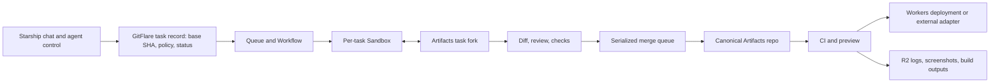

# GitFlare: Cloudflare platform viability

Research date: 2026-10-02 (America/New_York). Cloudflare and GitHub claims link to their documentation. Local repository observations come from the playground checkouts on this date; Git pack sizes are local proxies, not proof that an Artifacts import succeeds.

## Verdict

**Viable as a focused agent-development platform for small to medium Git repositories, especially Workers projects.** Cloudflare Artifacts is the Git-compatible source store, Workers and Durable Objects can coordinate work, Sandboxes/Containers can run Linux agents and tests, and Workers Builds can deploy Workers from Artifacts with branch Previews. The value proposition has to be the *workflow layer*: task isolation, asynchronous updates, review, merging, policy, reproducible tests, and deployment history. Artifacts supplies Git storage and protocol, not a GitHub-like product UI or pull-request workflow. [Artifacts overview](https://developers.cloudflare.com/artifacts/), [Artifacts repositories](https://developers.cloudflare.com/artifacts/concepts/repositories/), [Artifacts and Workers Builds](https://developers.cloudflare.com/workers/ci-cd/builds/git-integration/artifacts-integration/)

Cloudflare announced **open beta on October 1, 2026**, available on Workers Paid. Artifacts operations and storage billing begins October 14, 2026. Confirm the account can create and import repositories before treating it as a production source of truth. [Artifacts changelog](https://developers.cloudflare.com/changelog/product/artifacts/), [pricing](https://developers.cloudflare.com/artifacts/platform/pricing/)

## Product mapping

| GitFlare responsibility | Cloudflare fit | Design implication |
| --- | --- | --- |
| Canonical code and parallel task branches | **Artifacts** offers standard Git smart HTTP for clone/fetch/pull/push, repository forks, repo-scoped read/write tokens, and Workers/REST control planes. Cloudflare recommends a repo per agent/session to avoid a hot shared repo. | Keep a reviewed baseline; fork per task; expose diffs/reviews and merge accepted work through GitFlare. A Git CLI in a sandbox can do merges. [Git protocol](https://developers.cloudflare.com/artifacts/api/git-protocol/), [best practices](https://developers.cloudflare.com/artifacts/concepts/best-practices/) |
| Web API, event ingress, UI backend | **Workers** handle short request-side logic and storage bindings. | Keep compilation, Git subprocesses, and long tests out of the Worker isolate. Paid Workers have 128 MB memory and up to 5 minutes active CPU per invocation. [Workers limits](https://developers.cloudflare.com/workers/platform/limits/), [pricing](https://developers.cloudflare.com/workers/platform/pricing/) |
| Per-task live state, locks, streams | **SQLite-backed Durable Object** per task or repo can serialize transitions and stream logs. | Avoid one global coordinator: an individual object is single-threaded, with a soft ~1,000 request/s limit and 10 GB storage cap. [Durable Objects limits](https://developers.cloudflare.com/durable-objects/platform/limits/) |
| Metadata and durable records | **D1** for users/projects/tasks/reviews; **R2** for build artifacts, logs, screenshots, and large files. | Partition D1 by tenant/project as needed: one database is 10 GB and processes queries serially. Use R2 rather than Artifacts for outputs and large binaries. [D1 limits](https://developers.cloudflare.com/d1/platform/limits/), [R2 limits](https://developers.cloudflare.com/r2/platform/limits/) |
| Async dispatch and recovery | **Queues** for job messages; **Workflows** for durable multi-step execution, retries, waits, and status. Artifacts push events can trigger Workflows. | Use idempotency keys and terminal job records. Queues retain messages at most 14 days on Paid; Workflows keep completed state 30 days on Paid, so persist audit history separately. [Queues limits](https://developers.cloudflare.com/queues/platform/limits/), [Workflows limits](https://developers.cloudflare.com/workflows/reference/limits/), [Artifacts CI guide](https://developers.cloudflare.com/artifacts/guides/build-and-deploy-on-push/) |
| Agent work, builds, arbitrary tests | **Sandboxes/Containers** run Linux commands in isolated microVMs, with an agent's task tied to a sandbox. Cloudflare's `@cloudflare/ci` starts sandbox runners from an Artifacts-triggered Workflow and can cache dependencies by lockfile. | One sandbox per task, scoped network and credentials, explicit sleep/cleanup. Keep secrets in the Worker and proxy allowed requests. Containers have 256 MiB–12 GiB predefined sizes, up to 4 vCPU and 20 GB disk. The sandbox Container's Durable Object scheduling policy is still marked public beta. [Artifacts CI guide](https://developers.cloudflare.com/artifacts/guides/build-and-deploy-on-push/), [agent runner](https://developers.cloudflare.com/sandbox/get-started/build-a-coding-agent-runner/), [network](https://developers.cloudflare.com/sandbox/network/), [Container limits](https://developers.cloudflare.com/containers/platform/limits/) |
| Worker CI and deployment previews | **Workers Builds** connects Artifacts directly; non-`main` pushes can create Worker Previews. | Native integration is useful for Workers projects. Artifacts integration currently requires `main` as production branch. Preview secrets/bindings need explicit configuration and isolation. [Artifacts integration](https://developers.cloudflare.com/workers/ci-cd/builds/git-integration/artifacts-integration/), [Previews](https://developers.cloudflare.com/workers/previews/), [Preview configuration](https://developers.cloudflare.com/workers/previews/configuration/) |
| Browser checks and secure pilot access | **Browser Run** supports browser sessions for visual/end-to-end checks; **Access** can protect a Worker and its Previews. | Browser Run is a testing service, not the app's test runner. Access can gate a private pilot, while GitFlare still needs its own per-repository authorization and audit logic. [Browser Run limits](https://developers.cloudflare.com/browser-run/limits/), [Access application types](https://developers.cloudflare.com/cloudflare-one/access-controls/applications/choose-application-type/) |

## Hard constraints and risk

1. **Repository size is the first gate.** Artifacts caps each repository at **1 GB** and any individual Git blob at **32 MB**; account storage defaults to 1 TB (increase on request). A large monorepo, checked-in datasets, media, or long-lived binary history can fail. R2 supports objects up to 5 TiB, but putting a pointer in Git and the payload in R2 requires GitFlare's own convention and tooling. Do not assume Git LFS support. [Artifacts limits](https://developers.cloudflare.com/artifacts/platform/limits/), [R2 limits](https://developers.cloudflare.com/r2/platform/limits/)
2. **Workers Builds is a bounded Worker deployment path.** It has six concurrent builds on Paid, a 20-minute timeout, and 6,000 included build minutes/month. For custom CI, Cloudflare documents an Artifacts push trigger, Workflow, and `@cloudflare/ci` sandbox runners with dependency caching and parallel checks. GitFlare still owns job policy, statuses, review gating, and non-Worker deployment adapters. [Builds limits and pricing](https://developers.cloudflare.com/workers/ci-cd/builds/limits-and-pricing/), [Artifacts CI guide](https://developers.cloudflare.com/artifacts/guides/build-and-deploy-on-push/)
3. **Parallelism requires controlled integration.** Cloudflare explicitly suggests separate Artifacts repos per agent. GitFlare must record the common base SHA, run tests for each candidate, detect changed-base/conflicting edits, merge or rebase serially, then rerun the relevant tests on the integrated commit. This is an architecture inference from Git semantics and Artifacts' isolation guidance, not a built-in Artifacts feature. [Artifacts best practices](https://developers.cloudflare.com/artifacts/concepts/best-practices/)
4. **Artifacts is Git-compatible, not complete Git hosting.** Push uses protocol v1 receive-pack; clone/fetch support v1/v2, with some optional capabilities absent. Control-plane APIs cover repository management and tokens; GitFlare has to implement its own review objects, comments, protected-branch rules, check aggregation, search, notifications, and authorization policy. [Git protocol](https://developers.cloudflare.com/artifacts/api/git-protocol/), [Repositories](https://developers.cloudflare.com/artifacts/concepts/repositories/)
5. **Sandbox economics and security need measurement.** Containers bill active CPU plus provisioned memory/disk while running, with separate Workers/Durable Objects and possible regional egress/log charges. As a rate illustration, one `standard-2` sandbox (1 vCPU, 6 GiB memory, 12 GB disk) running one hour at 50% active CPU is about **$0.093 before included monthly allowances**, model inference, network overages, logs, and other services. Sleep/terminate idle sessions. [Container pricing](https://developers.cloudflare.com/containers/platform/pricing/), [Sandbox pricing](https://developers.cloudflare.com/sandbox/platform/pricing/), [network controls](https://developers.cloudflare.com/sandbox/network/)
6. **Previews have limits and data isolation obligations.** Worker Previews have per-branch URLs and separate configuration, but production settings are not inherited; configure preview resources deliberately. Browser Run has 200 concurrent paid browser sessions by default, 3 new instances/s, 60-second idle timeout (extendable to 10 minutes), and charges beyond included browser-hours/concurrency. [Previews](https://developers.cloudflare.com/workers/previews/), [Preview configuration](https://developers.cloudflare.com/workers/previews/configuration/), [Browser Run limits](https://developers.cloudflare.com/browser-run/limits/), [pricing](https://developers.cloudflare.com/browser-run/pricing/)

## Suggested proving sequence

1. Inventory each candidate playground repo: full Git size, largest blob, ignored build/data assets, language/toolchain, test duration, deployment target, and required secrets. The 1 GB/32 MB Artifacts gates and 20-minute Workers Builds gate determine which examples fit natively.
2. Import one small Workers project into Artifacts, fork it for two independent agent tasks, and prove concurrent clone/edit/push. Build a diff/review object in GitFlare, integrate both against the same baseline, rerun tests, then deploy only the accepted commit.
3. Add one project that is **not** a Worker. Run its tests in a per-task Sandbox and store logs/results in R2. This establishes whether GitFlare is a general development platform or mainly an excellent Cloudflare-native lane.
4. Measure end-to-end times and cost by stage: sandbox startup, clone, dependency install/cache, agent execution, tests, merge/retest, preview deployment. Compare against the same workflow on the team's existing GitHub setup before claiming faster or leaner.

**Positioning inference:** GitFlare can plausibly beat GitHub for the narrow loop of *delegate → run in isolated environments → review outcomes → integrate → preview*, especially when the deployment target is Cloudflare. Claiming a general, faster GitHub replacement would require benchmarks, repository compatibility evidence, mature review/permissions features, and a path for projects beyond Workers.

GitHub already offers asynchronous coding agents and parallel sessions that produce pull requests, including third-party agents. That makes an objectively faster and clearer integration/review/deployment loop a more defensible differentiator than parallel agents by itself. [GitHub cloud agent](https://docs.github.com/en/copilot/concepts/agents/cloud-agent), [third-party agents](https://docs.github.com/en/copilot/concepts/agents/about-third-party-coding-agents)

## What is in `playground/` today

There are 23 top-level directories. Twenty have a `.git` checkout; `GitFlare/` and `GitHard/` were empty before this report, and `awesome-cf/` is a folder of Cloudflare examples without a root Git checkout. **GitFlare has no implementation yet.** The playground is a good test portfolio, but those directories vary from tiny web apps to native desktop software and a multi-gigabyte monorepo. Several remotes point to third-party open-source projects, so benchmark imports should preserve their provenance and licenses.

| Candidate | Local evidence | Fit for GitFlare |
| --- | --- | --- |
| [ThomasSpace](../ThomasSpace/package.json) | 33 tracked files; React/Vite; ~3.5 MB `.git` directory and 2.5 MB largest historical blob; build script, no test script; README specifies Coolify deployment. | **Git protocol smoke test.** Easy import and fork/merge demo. It cannot demonstrate rich CI by itself. |
| [OpenProspector](../OpenProspector/package.json) | 99 tracked files, 3.48 MiB packed Git history, 0.45 MB largest blob; Hono Worker + D1, Vite, Vitest, typecheck/build scripts. | **Best first end-to-end pilot.** Exercises Artifacts, sandbox CI, D1-backed Worker preview, and review of two agent changes. Its remote is `clawnify/OpenProspector`, so treat it as a benchmark fork. |
| [Starship](../Starship/AGENTS.md) | 3,066 tracked files; 3.92 MiB packed Git history, 1.78 MB largest blob; agent-control app. Current workflow builds Docker on Blacksmith, publishes to GHCR, deploys via Coolify; a separate workflow deploys a frontend to Cloudflare Pages. Its instructions favor direct pushes to `main`. | **Best real integration case.** Reuse its conversation/agent experience and route code changes into isolated GitFlare tasks. Its current deployment path needs adapters, and direct-to-main behavior would need a project policy change for review-first parallel execution. |
| [OnCo](../OnCo/.github/workflows/ci.yml) | 10,456 tracked files; 73.93 MiB packed Git history, 4.94 MB largest blob; Next.js site with 19 workflows including validation, testing, scheduled data refresh, and dataset release. | **Second-stage workflow test.** Good for many files, review provenance, scheduled jobs, and generated assets; do not try to translate every GitHub Action in the first release. |
| [Galileo-Microscope](../Galileo-Microscope/README.md) | 181 tracked files but 444.95 MiB packed history and a 27.7 MB CAD blob. | **Large binary edge test.** Near the 32 MB blob cap, with file types that do not suit ordinary code diff/review. |
| [t3code](../t3code/package.json) | 23,228 tracked files, 412.52 MiB packed history; a 48.4 MB historical blob; macOS/Windows desktop CI. | **Cannot import unchanged** under the current Artifacts 32 MB blob limit; native CI also requires external runners. |
| [PostHog](../posthog/pyproject.toml) | 45,350 tracked files, 6.35 GiB packed history, 59.7 MB historical blob, 128 workflow files. | **Cannot import unchanged** under both Artifacts repo and blob limits. Use as a later large-repo compatibility target, not an MVP example. |

Other useful later cases: `openscience` has a 13-workflow agent/science stack; `stagehand` can probe browser-agent tests; `gentlemanbird` has 26,838 tracked files and a native browser-engine build; `bifrost` and `chroma` each have ~0.85 GiB packed Git histories, close enough to the 1 GB cap that an actual import must decide eligibility.

The local [VibeSDK example](../awesome-cf/vibesdk/README.md) is especially relevant prior art. It already combines a Durable Object workspace, Artifacts-backed Git history, and Worker previews. Its [sync implementation](../awesome-cf/vibesdk/space/src/space/artifacts-sync.ts) serializes pushes, retries stale-ref failures, and checks ancestry before a force push. That demonstrates the primitives while showing why concurrent-write correctness and recovery belong in GitFlare's core design.

## Map the sketch to a product architecture

Keep each conversation linked to a task ID, base commit, candidate commit, test result, preview, and final deployment. Let Starship remain the user-facing conversation and agent-control surface initially. A task sandbox gets a short-lived write token for its own Artifacts fork. The canonical repo accepts only reviewed, tested results through a serialized integration step. If its baseline advanced, rebase or merge in a sandbox and rerun checks on the integrated commit. This is a recommended design, not an existing GitFlare feature.

The currently documented `@cloudflare/ci` path is a useful starting point: an Artifacts push event starts a Workflow; runners use isolated Sandboxes, can share a cached dependency snapshot, and report logs/status. GitFlare must still decide who may run a job, which commit a result applies to, whether review is complete, and when production deployment is allowed. [Artifacts CI guide](https://developers.cloudflare.com/artifacts/guides/build-and-deploy-on-push/)

## Viability gates and first proof

1. **Compatibility:** Import OpenProspector preserving Git commit IDs and refs; prove ordinary Git CLI clone/fetch/push; reject an oversized repository or blob with a useful explanation. Keep a GitHub mirror while Artifacts is in beta.
2. **Parallel correctness:** Fork the same reviewed baseline for two tasks, push them concurrently, show per-task diffs, merge both through one queue, detect a deliberate same-file conflict, and rerun tests after integration. Verify recovery if the orchestrator or Sandbox restarts mid-task.
3. **Useful execution:** Run OpenProspector's `test`, `typecheck`, and `build` with `@cloudflare/ci` or Sandbox runners; attach logs and a Worker preview to the exact commit. Restrict production deployment to an accepted integration commit.
4. **Existing workflow integration:** Connect Starship so chat creates and follows GitFlare tasks. Preserve Coolify/GHCR as an external deployment adapter for now. Prove one non-Worker deployment after the native Worker path works.
5. **Evidence for the speed/cost claim:** Measure task-to-sandbox-ready time, clone time, dependency cache hit rate, test time, accepted-commit-to-preview time, merge success/rework rate, and cost per merged task. Compare the same task on the current GitHub/Starship flow. Cloudflare container charges accrue while the instance runs, including provisioned memory and disk; model/API cost is separate. [Container pricing](https://developers.cloudflare.com/containers/platform/pricing/)

**Business assessment:** The technology is credible for a focused product. Demand and willingness to migrate source hosting are unproven. GitHub now supports parallel asynchronous coding agents, so the first users should see a concrete gain in review clarity, deployment speed, or total cost. The October 1 [Cloudflare announcement](https://developers.cloudflare.com/changelog/product/artifacts/) includes a “Build the next GitHub” competition with an October 14 submission deadline; if that is the immediate goal, the OpenProspector proof plus Starship integration is a tighter scope than broad GitHub feature parity.
